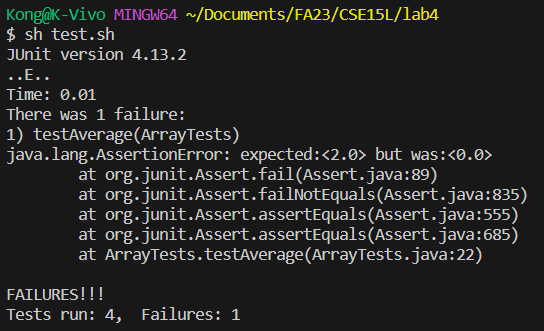
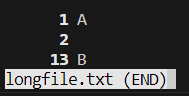

# Lab Report 3 - Felipe Kai Hu

This is the third lab report for CSE 15L.
In this lab, I will be going through the process of creating test cases for programs given in lab4 and reseaching new bash commands learned in class (`less`, `find` and `grep`).

## Part 1 - Bugs

A good example of a bug that cannot be easily found by simply reading the code can be found in ArrayExamples.java, specifically, in the averageWithoutLowest method. This is what I'll use to illustrate the next parts.

- We can start by choosing a failure-inducing input for the program:

```java
  @Test
  public void testAverage(){
    double[] input = { 2.0, 2.0 };
    assertEquals(2.0, ArrayExamples.averageWithoutLowest(input), 0.0001);
  }
```

- There is also inputs where the code runs without failures:

```java
  @Test
  public void testAverage2(){
    double[] input = { 2.0, 3.0 };
    assertEquals(3.0, ArrayExamples.averageWithoutLowest(input), 0.0001);
  }
```


- After writing a shell script to compile and run tests, we get the following output:

The `testAverage2()`{:.java} test passes, but the `testAverage()`{:.java} test fails.
In this test case, we would expect that after one of the 2 gets dropped, the average will be given by the only remaining number, 2.0. However, the program returns 0.0.



After careful examination of `ArrayExamples.java`, we can notice the bug in the line 33 of the code, where the if statement removes every instance of the lowest number instead of only a single one.:

```java
    if(arr.length < 2) { return 0.0; }
    double lowest = arr[0];
    for(double num: arr) {
      if(num < lowest) { lowest = num; }
    }
    double sum = 0;
    for(double num: arr) {
      if(num != lowest) { sum += num; }
    }
```

This can be fixed by rewriting the code this way:

```java
    if(arr.length < 2) { return 0.0; }
    double lowest = arr[0];
    for(double num: arr) {
      if(num < lowest) { lowest = num; }
    }
    double sum = 0;
    for(double num: arr) {
      sum += num;
    }
    sum -= lowest;
```

Instead of ignoring the lowest number, we can simply add all the numbers and then subtract the lowest one once. This way, only one number gets dropped and the average is calculated correctly.

## Part 2 - Researching Commands

### `less`

- `-p`

  This option allows us to specify a pattern to search for in the file. It will then jump to the first instance of the pattern in the file, for example:

  hello.txt:
  ```
  Title: Hello World

  Course: CSE 15L

  Content:

  Lorem ipsum dolor sit amet, consectetur adipiscing elit.
  Nam ut libero sodales, molestie odio eget, accumsan sapien.
  Sed mattis quam eget est rhoncus, et dignissim dui iaculis.
  Pellentesque eget lorem vestibulum, eleifend lorem egestas, vestibulum felis.
  Aenean rhoncus mauris ullamcorper, posuere velit eget, cursus purus.

  Duis convallis quam quis metus rhoncus tristique.
  Suspendisse eget lorem sit amet diam varius pulvinar id vestibulum est.
  Mauris porttitor justo molestie, iaculis arcu vitae, dictum ante.
  Morbi sit amet diam in diam malesuada dignissim ut non tellus.
  Quisque vitae dolor eget ex gravida cursus ac sed nisl.
  ```

  ```bash
  Kong@K-Vivo MINGW64 ~/Documents/FA23/CSE15L/lab4 (main)
  $ less -p "Content:" hello.txt
  ```

  
  
  As we can see, the command jumps directly to the line containing "Content:". This is useful for when we are looking for a specific text in a large file and want to look at the context around it.

  We can also use it in combination with other commands. For example, we can combine it with the JUnit test output from the previous part:

  ```bash
  Kong@K-Vivo MINGW64 ~/Documents/FA23/CSE15L/lab4 (main)
  $ sh test.sh
  JUnit version 4.13.2
  ..E..
  Time: 0.009
  There was 1 failure:
  1) testAverage(ArrayTests)
  java.lang.AssertionError: expected:<2.0> but was:<0.0>
          at org.junit.Assert.fail(Assert.java:89)
          at org.junit.Assert.failNotEquals(Assert.java:835)
          at org.junit.Assert.assertEquals(Assert.java:555)
          at org.junit.Assert.assertEquals(Assert.java:685)
          at ArrayTests.testAverage(ArrayTests.java:22)

  FAILURES!!!
  Tests run: 4,  Failures: 1

  Kong@K-Vivo MINGW64 ~/Documents/FA23/CSE15L/lab4 (main)
  $ sh test.sh | less -p Time
  ```

  

  Using the command like this, we can filter out the output of the test and only see the relevant information. Skipping more irrelevant header informations.

  Source: [GeeksForGeeks - less command in Linux with Examples](https://www.geeksforgeeks.org/less-command-linux-examples/)

- `-N`

  This option allows us to display the line numbers of the file, for example:

  ```bash
  Kong@K-Vivo MINGW64 ~/Documents/FA23/CSE15L/lab4 (main)
  $ less -N hello.txt
  ```

  

  As we can see[], the command displays the line numbers on the left side of the screen. This is useful for when we want to know the line number of a specific line in a file.

  And when combined with the `find` command, it can be used as an alternative way to find out how many files was found:

  ```bash
  Kong@K-Vivo MINGW64 ~/Documents/FA23/CSE15L/lab4 (main)
  $ find -name "*.java" | less -N
  ```

  

  Source: Bash manual for `less`

- `-s`

  This option allows us to squeeze multiple empty lines into a single empty line, for example:

  longfile.txt:
  ```
  A


  B
  ```

  ```bash
  Kong@K-Vivo MINGW64 ~/Documents/FA23/CSE15L/lab4 (main)
  $ less -s longfile.txt
  ```

  

  As we can see, the command only leaves one empty line between the two letters, which clean up the file and makes it easier to read.

  Source: [GeeksForGeeks - less command in Linux with Examples](https://www.geeksforgeeks.org/less-command-linux-examples/)

  This command can also be used alongside the `-N` option:

  ```bash
  Kong@K-Vivo MINGW64 ~/Documents/FA23/CSE15L/lab4 (main)
  $ less -s -N longfile.txt
  ```

  

  This way, we can see the same cleaned version of the file without losing information on how many lines were skipped.

  Source: [GeeksForGeeks - less command in Linux with Examples](https://www.geeksforgeeks.org/less-command-linux-examples/)

- `-S`

  This option allows us to chop long lines instead of wrapping them, for example:

  longlines.txt:
  ```
  Lorem ipsum dolor sit amet, consectetur adipiscing elit. Etiam ac vehicula leo. Vivamus imperdiet bibendum porta. Duis pellentesque volutpat dapibus. Quisque auctor ullamcorper libero molestie vestibulum. Suspendisse in justo venenatis, fermentum erat a, convallis nisi. Curabitur volutpat justo quis nunc tempus blandit. Vivamus vel tempus augue. Maecenas pharetra rutrum ultrices. Nam fringilla mollis vehicula. Donec auctor risus ac est pellentesque, nec interdum augue iaculis. Aliquam eget sem arcu. Nulla ac nunc a risus mattis sollicitudin quis sit amet nibh. Fusce est diam, molestie ut interdum sed, luctus in sem. In vitae ullamcorper risus.

  Integer sagittis urna nec lacus suscipit egestas. Morbi facilisis lorem a neque gravida dignissim sit amet sed purus. Nullam sodales lacus lectus, et tincidunt sapien finibus facilisis. Lorem ipsum dolor sit amet, consectetur adipiscing elit. Integer vel metus tellus. Sed tortor lorem, aliquet ut vulputate nec, pulvinar ac mauris. In ac lacus ante. Aenean sed egestas diam. Donec maximus tincidunt tortor, at commodo justo iaculis eget. Phasellus dictum quis ligula et finibus. Donec nec convallis metus.   ```
  ```

  ```bash
  Kong@K-Vivo MINGW64 ~/Documents/FA23/CSE15L/lab4 (main)
  $ less -S longlines.txt
  ```

  

  As we can see, the command chops the long lines instead of wrapping them, which makes reading the file more consistent.

  This option is useful for when there are long paths in the output of the `find` command:

  ```bash
  Kong@K-Vivo MINGW64 ~/Documents/FA23/CSE15L/lab4 (main)
  $ find -name "*.txt" | less -S
  ```

  

  We can see that the long paths are chopped instead of wrapped, making sure that the line numbers are consistent with amount of files found.

  Source: Bash manual for `less`

### `find`

- `-newer [File]`

  This option allows us to find files that are newer than the specified file, for example:

  ```bash
  Kong@K-Vivo MINGW64 ~/Documents/FA23/CSE15L/lab4 (main)
  $ find -newer old.txt
  .
  ./new.txt
  ```

  As we can see, the command returns the file `new.txt` because it is newer than `old.txt`.

  The command can also be used to filter out outputs from other commands, for example:

  ```bash
  Kong@K-Vivo MINGW64 ~/Documents/FA23/CSE15L/lab4 (main)
  $ sh test.sh > out.txt

  Kong@K-Vivo MINGW64 ~/Documents/FA23/CSE15L/lab4 (main)
  $ find -newer ArrayExamples.class -name "*.txt"
  ./out.txt
  ```

  When used like that, we can see that the command only returns the file `out.txt` because it is newer than `ArrayExamples.class`.

  Source: Bash manual for `find`

- `-type [Type]`

  This option allows us to find files of a specific type, for example:

  ```bash
  Kong@K-Vivo MINGW64 ~/Documents/FA23/CSE15L/lab4 (main)
  $ find -type f
  ./ArrayExamples.class
  ./ArrayExamples.java
  ./ArrayTests.class
  ./ArrayTests.java
  ./FileExample.class
  ./FileExample.java
  ./hello.txt
  ./iamaridiculouslylongfilename.txt
  ./less-out1.png
  ./less-out2.png
  ./less-out3.png
  ./less-out4.png
  ./less-out5.png
  ./less-out6.png
  ./less-out7.png
  ./less-out8.png
  ./lib/hamcrest-core-1.3.jar
  ./lib/junit-4.13.2.jar
  ./LinkedList.class
  ./LinkedListExample.java
  ./LinkedListTests.class
  ./LinkedListTests.java
  ./ListExamples.class
  ./ListExamples.java
  ./ListTests$PalindromeChecker.class
  ./ListTests.class
  ./ListTests.java
  ./longfile.txt
  ./longlines.txt
  ./new.txt
  ./Node.class
  ./old.txt
  ./out.txt
  ./report.md
  ./StringChecker.class
  ./test.sh
  ./testFail.png
  ```

  As we can see, the command returns all the files in the current directory.

  We can also use it to find directories:

  ```bash
  Kong@K-Vivo MINGW64 ~/Documents/FA23/CSE15L/lab4 (main)
  $ find -type d
  .
  ./lib
  ```

  As we can see, the command returns the current directory and the `lib` directory.

  Source: Bash manual for `find`

- `-size [+/-][N]`

  This option allows us to find files of a specific size, for example:

  ```bash
  Kong@K-Vivo MINGW64 ~/Documents/FA23/CSE15L/lab4 (main)
  $ find -size +10
  ./less-out1.png
  ./less-out2.png
  ./less-out3.png
  ./less-out4.png
  ./less-out7.png
  ./less-out8.png
  ./lib/hamcrest-core-1.3.jar
  ./lib/junit-4.13.2.jar
  ./report.md
  ./testFail.png
  ```

  As we can see, the command returns all the files that are larger than 10 blocks. This is useful for when we want to find files that are occupying too much space in our computer.

  The command can also be used to find files that are smaller than a specific size:

  ```bash
  Kong@K-Vivo MINGW64 ~/Documents/FA23/CSE15L/lab4 (main)
  $ find -size -1
  .
  ./iamaridiculouslylongfilename.txt
  ./lib
  ./new.txt
  ./old.txt
  ```

  In this output, only very small files and directories are returned.

  Source: Bash manual for `find`

- `-empty`

  As the name suggests, this option allows us to find empty files, for example:

  ```bash
  Kong@K-Vivo MINGW64 ~/Documents/FA23/CSE15L/lab4 (main)
  $ find -empty
  ./iamaridiculouslylongfilename.txt
  ./new.txt
  ./old.txt
  ```

  This has a similar output to the previous command, but it only returns empty files, and no directories.

  We can combine this with the `-type` option to find empty directories:

  ```bash
  Kong@K-Vivo MINGW64 ~/Documents/FA23/CSE15L/lab4 (main)
  $ find -empty -type d
  ./emptydir
  ```

  As we can see, the command returns only completely empty directories.

  Source: Bash manual for `find`

### `grep`

- `-i`

  With this option, we can make the command ignore case when searching for a pattern, for example:

  ```bash
  Kong@K-Vivo MINGW64 ~/Documents/FA23/CSE15L/lab4 (main)
  $ grep -i "content" hello.txt 
  Content:
  ```

  As we can see, the command returns the line containing "Content:" even though the pattern we searched for was "content".

  In order to better illustrate the use of this command, we can again match it against the output of the JUnit test:

  ```bash
  Kong@K-Vivo MINGW64 ~/Documents/FA23/CSE15L/lab4 (main)
  $ sh test.sh | grep -i "fail"
  There was 1 failure:
          at org.junit.Assert.fail(Assert.java:89)
          at org.junit.Assert.failNotEquals(Assert.java:835)
  FAILURES!!!
  Tests run: 4,  Failures: 1
  ```

  As we can see, the command returns all the lines containing "fail", even though the case is different.

- `-C n`

  This option allows us to display n lines of context around the pattern, for example:

  ```bash
  Kong@K-Vivo MINGW64 ~/Documents/FA23/CSE15L/lab4 (main)
  $ grep -C 3 "Content" hello.txt

  Course: CSE 15L

  Content:

  Lorem ipsum dolor sit amet, consectetur adipiscing elit.
  Nam ut libero sodales, molestie odio eget, accumsan sapien.
  ```

  As we can see, the command returns the line containing "Content:" and the 3 lines before and after it. This is useful for when we want to see the context around a pattern.

  We can also use it to filter out the output of the JUnit test:

  ```bash
  Kong@K-Vivo MINGW64 ~/Documents/FA23/CSE15L/lab4 (main)
  $ sh test.sh | grep -C 1 "fail"
  Time: 0.01
  There was 1 failure:
  1) testAverage(ArrayTests)
  java.lang.AssertionError: expected:<2.0> but was:<0.0>
          at org.junit.Assert.fail(Assert.java:89)
          at org.junit.Assert.failNotEquals(Assert.java:835)
          at org.junit.Assert.assertEquals(Assert.java:555)
  ```

  We can notice also that the same line is not repeated multiple times.
  

  Source: Bash manual for `grep`

- `-v`

  This option allows us to invert the match, for example:

  ```bash
  Kong@K-Vivo MINGW64 ~/Documents/FA23/CSE15L/lab4 (main)
  $ grep -v "Content" hello.txt
  Title: Hello World

  Course: CSE 15L


  Lorem ipsum dolor sit amet, consectetur adipiscing elit.
  Nam ut libero sodales, molestie odio eget, accumsan sapien.
  Sed mattis quam eget est rhoncus, et dignissim dui iaculis.
  Pellentesque eget lorem vestibulum, eleifend lorem egestas, vestibulum felis.
  Aenean rhoncus mauris ullamcorper, posuere velit eget, cursus purus.

  Duis convallis quam quis metus rhoncus tristique.
  Suspendisse eget lorem sit amet diam varius pulvinar id vestibulum est.
  Mauris porttitor justo molestie, iaculis arcu vitae, dictum ante.
  Morbi sit amet diam in diam malesuada dignissim ut non tellus.
  Quisque vitae dolor eget ex gravida cursus ac sed nisl.
  ```

  As we can see, the command returns all the lines that do not contain "Content". This is useful for when we want to filter out a specific pattern.

  We can also use it to filter out the output of the JUnit test:

  ```bash
  Kong@K-Vivo MINGW64 ~/Documents/FA23/CSE15L/lab4 (main)
  $ sh test.sh | grep -v "fail"
  JUnit version 4.13.2
  ..E..
  Time: 0.011
  1) testAverage(ArrayTests)
  java.lang.AssertionError: expected:<2.0> but was:<0.0>
          at org.junit.Assert.assertEquals(Assert.java:555)
          at org.junit.Assert.assertEquals(Assert.java:685)
          at ArrayTests.testAverage(ArrayTests.java:22)

  FAILURES!!!
  Tests run: 4,  Failures: 1
  ```

  As we can see, the command returns all the lines that do not contain "fail". This way, we can filter out the output of the test and only see the relevant information.

  Source: Bash manual for `grep`

- `-n`

  This option allows us to display the line numbers of the file, for example:

  ```bash
  Kong@K-Vivo MINGW64 ~/Documents/FA23/CSE15L/lab4 (main)
  $ grep -n "Content" hello.txt
  5:Content:
  ```

  As we can see, the command returns the line number of the line containing "Content:".

  We can also use it to count the amount of files found by the `find` command:

  ```bash
  Kong@K-Vivo MINGW64 ~/Documents/FA23/CSE15L/lab4 (main)
  $ find -name "*.txt" > out.txt

  Kong@K-Vivo MINGW64 ~/Documents/FA23/CSE15L/lab4 (main)
  $ grep -n txt out.txt 
  1:./hello.txt
  2:./iamaridiculouslylongfilename.txt
  3:./longfile.txt
  4:./longlines.txt
  5:./new.txt
  6:./old.txt
  7:./out.txt
  ```

  As we can see, the command returns the line number of each file found by the `find` command.

  Source: Bash manual for `grep`